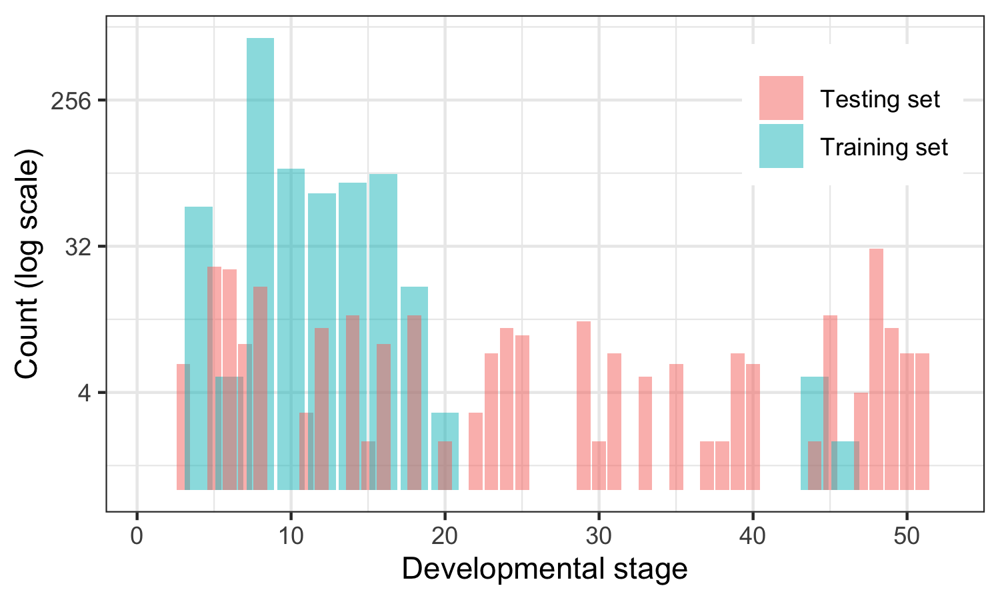

## Results
### Batch effect adjustment
Before batch adjustment, the two datasets are clearly separated in the first two principal component dimensions (Fig. {@fig:PACbatch}A).
After being adjusted for batch effect, this dataset-specific effect is less evident (Fig. {@fig:PACbatch}B).
The amount of variance explained in each component also seems to be more balanced.

{#fig:PACbatch width="90%"}

### STIR feature selection and TPOT cross-validated balanced accuracy
The training dataset consists of 1043 in vivo parasite isolates, each with 4952 transcriptomic features, out of which STIR selects 1068.

TPOT [...]

### Test sample selection
In general, the parasite developmental stages in the training set are smaller than those in the test set (Fig. {@fig:stages}).
Because of this difference in distribution, we could not use stage of parasites as guideline to select the test samples.
Instead, at 24 hpi, we decided to compute the average of the two lowest probabilities per isolate (across two types of treatments and two biological replicates).
In other words, setting our goal to be detecting isolates with SLOW parasite clearance rate (SLOW = 1), we want to decrease the false negative rate (SLOW isolates predicted as FAST) by sacrificing some false positives (FAST isolates predicted as SLOW).

{#fig:stages width="70%"}

